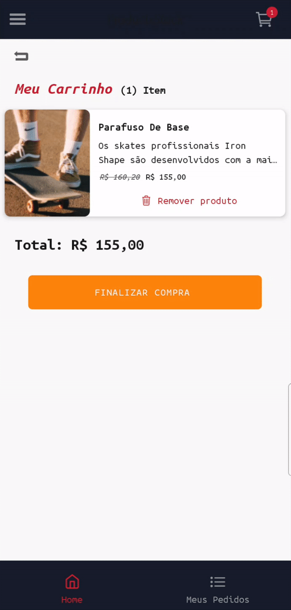
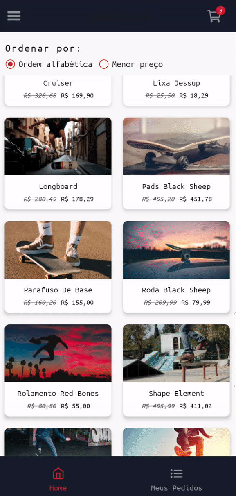

<h1 align="center">
  React Native E-Commerce Project
</h1>

## Demo:

<div>
  
  
  
  
  
  
  
  
</div>

A sample skating shop built on top of React Native

Objective:
- Show all products sorted alphabetically or by price (asc).
- Show product details.
- Add and remove products from shopping cart.
- Simulate a purchase, adding products to "my purchases" list.
- Remove products from "my purchases" list.

## Technologies

:white_check_mark: React Native\
:white_check_mark: Styled-components\
:white_check_mark: Axios\
:white_check_mark: React-navigation\
:white_check_mark: Redux\
:white_check_mark: Redux-persist\
:white_check_mark: Git-commit-msg-linter\
:white_check_mark: React Hooks\
:white_check_mark: Babel-plugin-root-import\
:white_check_mark: Vector Icons\
:white_check_mark: Immer\
:white_check_mark: Lodash\
:white_check_mark: lottie-react-native\
:white_check_mark: react-native-paper\
:white_check_mark: moti\
:white_check_mark: react-native-reanimated\
:white_check_mark: react-native-image-pan-zoom\
:white_check_mark: Date-fns\
:white_check_mark: react-native-fast-image\
:white_check_mark: redux-saga\
:white_check_mark: Typescript\
:white_check_mark: Jest\
:white_check_mark: @testing-library/jest-native\
:white_check_mark: @testing-library/react-hooks\
:white_check_mark: @testing-library/react-native

## Test this project

#### clone

```bash
$ git clone https://github.com/MRLSK8/SK8shop.git && cd SK8shop
```

#### install packages

```bash
$ yarn install
```

#### start

```bash
$ yarn start
```

#### run

```bash
$ yarn android
```

#### generate APK

```bash
$ yarn android:build
```

#### It will generate an APK on android/app/build/outputs/apk/release/app-release.apk, send it to cellphone and install it.

## Running Tests
```bash
  $ yarn test
```
#### with coverage
```bash
  $ yarn test:coverage
```

## File structure

The file structure are in the following way:

```bash
├── src/
│   ├── @types/
│   │   └── index.d.js
│   ├── assets/
│   │   └── Icons
│   │       └── skateboard.svg
│   ├── components/
│   │   ├── GoBackButton/
|   |   |   ├── index.tsx
|   |   |   └── style.ts
|   |   ├── ImagePreview/ 
|   |   |   ├── index.tsx
|   |   |   └── style.ts
|   |   ├── ProductItem/ 
|   |   |   ├── index.tsx
|   |   |    style.ts
│   │   └── ScreenHeader/
|   |       ├── index.tsx
|   |       └── style.ts
│   ├── config/
│   │   └── statusBarConfig.ts
│   ├── helpers/
│   │   └──  numberToCurrency.ts
│   ├── hooks/
│   │   └── reduxHooks.tsx
│   ├── routes/
│   │   └── app.routes.ts
│   │   └── auth.routes.ts
│   │   └── bottom-tabs.routes.ts
│   │   └── index.ts
│   │   └── products.routes.ts
│   │   └── purchases.routes.ts
│   │   └── styles.ts
│   ├── screens/
│   │   ├── AppScreens/
|   |   |   ├── myPurchases/ 
|   |   |   |   ├── index.tsx
|   |   |   |   └── style.ts
|   |   |   ├── productDetails/ 
|   |   |   |   ├── index.tsx
|   |   |   |   └── style.ts
|   |   |   ├── productsList/ 
|   |   |   |   ├── index.tsx
|   |   |   |   └── style.ts
|   |   |   └── shoppingCart/ 
|   |   |       ├── index.tsx
|   |   |       └── style.ts
|   |   └── AuthScreens/ 
|   |       ├── signIn/ 
|   |       |   ├── index.tsx
|   |       |   └── style.ts
|   |       └── signUp/ 
|   |           ├── index.tsx
|   |           └── style.ts
│   ├── services/
│   │   └── api.ts
│   ├── store/
│   │   └── actions/
│   │   └── ducks/
│   │   └── sagas/
│   │   └── types/
│   │   └── index.ts
│   ├── styles/
│   │   ├── globalStyles.ts
│   │   └── index.ts
│   └── index.tsx
├── .buckconfig
├── .editorconfig
├── .eslintrc.js
├── .eslintrc.json
├── .gitattributes
├── .gitignore
├── .prettierrc.js
├── .watchmanconfig
├──  app.json
├── babel.config.js
├── index.js
├── LICENSE
├── metro.config
├── package.json
├── react-native.config.js
├── tsconfig.js
├── yarn.lock
```
